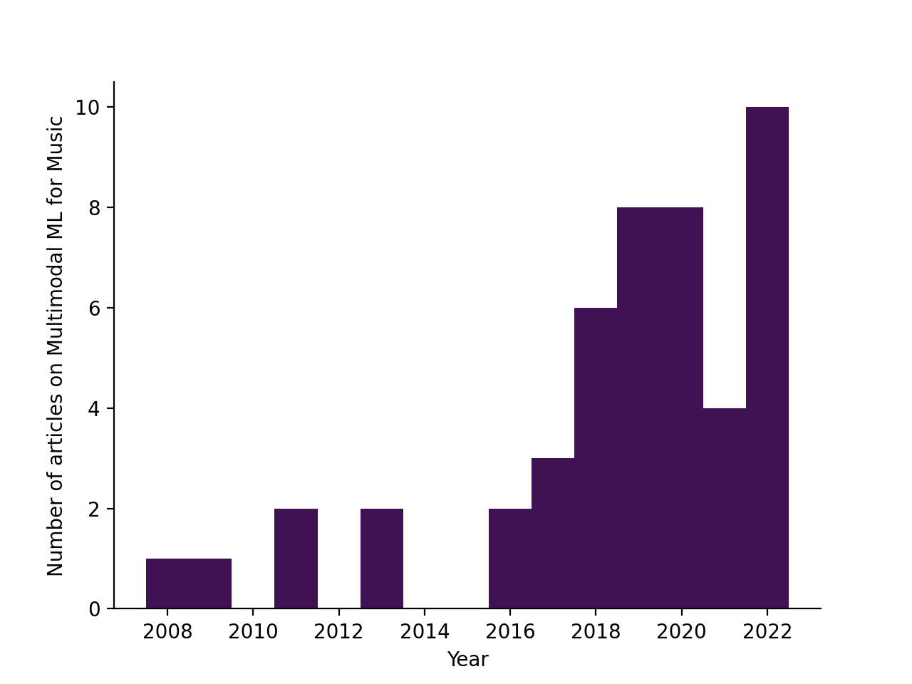
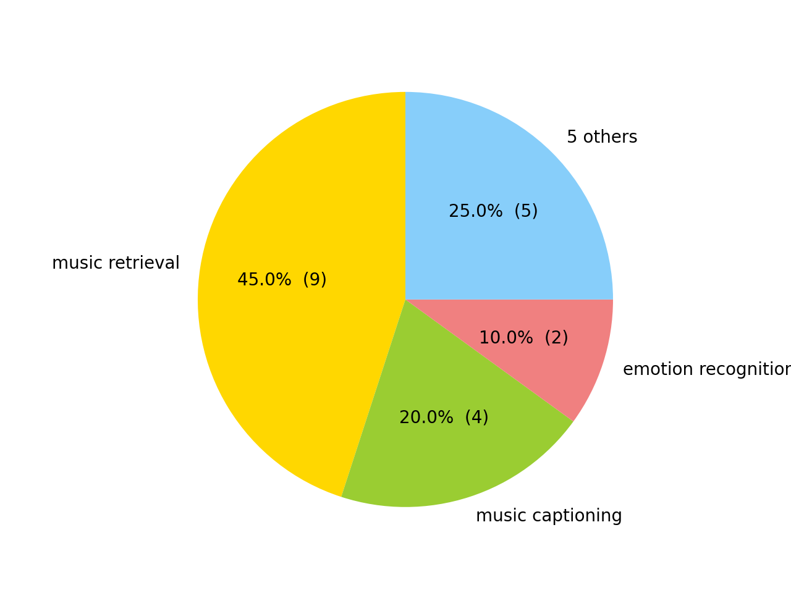

# Multimodal Machine Learning for Music (MML4Music) 
This repo contains a curated list of academic papers, datasets and other resources on multimodal machine learning (MML) research applied to music.
By [Ilaria Manco](http://ilariamanco.com/) (i.manco@qmul.ac.uk), [Centre for Digital Music](http://c4dm.eecs.qmul.ac.uk/), [QMUL](https://www.qmul.ac.uk/).

This is not meant to be an exhaustive list, as MML for music is a varied and growing field, tackling a wide variety of tasks, from music information retrieval to generation, 
through many different methods. Since this research area is also not yet well established, conventions and definitions aren't set in stone and this list aims to provide a point of reference 
for its ongoing development.

## Table of Contents

* [Academic Papers](#papers)
    * [Survey Papers](#survey-papers)
    * [Journal and Conference Papers](#journal-and-conference-papers)
* [Datasets](#datasets)
* [Workshops, Tutorials & Talks](#workshops-tutorials-&-talks)
* [Other Projects](#other-projects)
* [Statistics & Visualisations](#statistics-&-visualisations)
* [How to Contribute](#how-to-contribute)
* [Other Resources](#other-resources)

## Papers 

### Survey Papers
* [Multimodal music information processing and retrieval: Survey and future challenges](https://arxiv.org/pdf/1902.05347.pdf) (F. Simonetta et al., 2019)
* [Cross-Modal Music Retrieval and Applications: An Overview of Key Methodologies](https://arxiv.org/pdf/1902.04397.pdf) (M. Muller et al., 2019)

### Journal and Conference Papers 
Summary of papers on multimodal machine learning for music, including the review papers highlighted [above](#survey-papers).

#### Audio-Text
| Year |  Paper Title | Code |
|------|-------------------------------|------|
 |  2022  |  [Interpreting Song Lyrics with an Audio-Informed Pre-trained Language Model](https://arxiv.org/abs/2208.11671)  |  
 |  2022  |  [Conversational Music Retrieval with Synthetic Data](https://research.google/pubs/pub51943/)  |  
 |  2022  |  [Contrastive audio-language learning for music](https://arxiv.org/abs/2208.12208)  |  [GitHub](https://github.com/ilaria-manco/muscall) 
 |  2022  |  [Learning music audio representations via weak language supervision](https://arxiv.org/abs/2112.04214)  |  [GitHub](https://github.com/ilaria-manco/mulap) 
 |  2022  |  [Mulan: A joint embedding of music audio and natural language](https://arxiv.org/abs/2208.12415)  |  
 |  2022  |  [RECAP: Retrieval Augmented Music Captioner](https://arxiv.org/abs/2212.10901v1)  |  
 |  2022  |  [Clap: Learning audio concepts from natural language supervision](https://arxiv.org/abs/2206.04769)  |  [GitHub](https://github.com/microsoft/CLAP) 
 |  2022  |  [Toward Universal Text-to-Music Retrieval](https://arxiv.org/abs/2211.14558)  |  [GitHub](https://github.com/SeungHeonDoh/music-text-representation) 
 |  2021  |  [MusCaps: Generating Captions for Music Audio](https://arxiv.org/abs/2104.11984)  |  [GitHub](https://github.com/ilaria-manco/muscaps) 
 |  2020  |  [MusicBERT - learning multi-modal representations for music and text](https://www.aclweb.org/anthology/2020.nlp4musa-1.13)  |  
 |  2020  |  [Music autotagging as captioning](https://www.aclweb.org/anthology/2020.nlp4musa-1.14)  |  
 |  2019  |  [Deep cross-modal correlation learning for audio and lyrics in music retrieval](https://arxiv.org/pdf/1711.08976.pdf)  |  
 |  2018  |  [Music mood detection based on audio and lyrics with deep neural net](https://arxiv.org/pdf/1809.07276.pdf)  |  
 |  2016  |  [Exploring customer reviews for music genre classification and evolutionary studies](https://repositori.upf.edu/bitstream/handle/10230/33063/Oramas_ISMIR2016_expl.pdf?sequence=1&isAllowed=y)  |  
 |  2016  |  [Towards Music Captioning: Generating Music Playlist Descriptions](https://arxiv.org/pdf/1608.04868.pdf)  |  
 |  2008  |  [Multimodal Music Mood Classification using Audio and Lyrics](http://citeseerx.ist.psu.edu/viewdoc/download?doi=10.1.1.182.426&rep=rep1&type=pdf)  |  

#### Other
| Year |  Paper Title | Code |
|------|-------------------------------|------|
 |  2021  |  [Multimodal metric learning for tag-based music retrieval](https://arxiv.org/pdf/2010.16030.pdf)  |  [GitHub](https://github.com/minzwon/tag-based-music-retrieval) 
 |  2020  |  [Large-Scale Weakly-Supervised Content Embeddings for Music Recommendation and Tagging](https://ieeexplore.ieee.org/abstract/document/9053240)  |  
 |  2020  |  [Learning Contextual Tag Embeddings for Cross-Modal Alignment of Audio and Tags](https://arxiv.org/pdf/2010.14171.pdf)  |  [GitHub](https://github.com/xavierfav/ae-w2v-attention) 
 |  2019  |  [Audio-visual embedding for cross-modal music video retrieval through supervised deep CCA](https://arxiv.org/pdf/1908.03744.pdf)  |  
 |  2019  |  [Query-by-Blending: a Music Exploration System Blending Latent Vector Representations of Lyric Word, Song Audio, and Artist](https://archives.ismir.net/ismir2019/paper/000015.pdf)  |  
 |  2019  |  [Learning Affective Correspondence between Music and Image](https://arxiv.org/pdf/1904.00150.pdf)  |  
 |  2019  |  [Multimodal music information processing and retrieval: Survey and future challenges](https://arxiv.org/pdf/1902.05347.pdf)  |  
 |  2019  |  [Cross-Modal Music Retrieval and Applications: An Overview of Key Methodologies](https://arxiv.org/pdf/1902.04397.pdf)  |  
 |  2019  |  [Creating a Multitrack Classical Music Performance Dataset for Multimodal Music Analysis: Challenges, Insights, and Applications](https://arxiv.org/pdf/1612.08727.pdf)  |  
 |  2019  |  [Query by Video: Cross-Modal Music Retrieval](www.gracenote.com)  |  
 |  2018  |  [The Sound of Pixels](https://arxiv.org/pdf/1804.03160.pdf)  |  [GitHub](https://github.com/hangzhaomit/Sound-of-Pixels) 
 |  2018  |  [Image generation associated with music data](https://openaccess.thecvf.com/content_cvpr_2018_workshops/papers/w49/Qiu_Image_Generation_Associated_CVPR_2018_paper.pdf)  |  
 |  2018  |  [Multimodal Deep Learning for Music Genre Classification](https://transactions.ismir.net/articles/10.5334/tismir.10/)  |  [GitHub](https://github.com/fvancesco/music_resnet_classification) 
 |  2018  |  [JTAV: Jointly Learning Social Media Content Representation by Fusing Textual, Acoustic, and Visual Features](http://arxiv.org/abs/1806.01483)  |  [GitHub](https://github.com/mengshor/JTAV) 
 |  2018  |  [Cbvmr: content-based video-music retrieval using soft intra-modal structure constraint](https://dl.acm.org/doi/abs/10.1145/3206025.3206046)  |  [GitHub](https://github.com/csehong/VM-NET) 
 |  2017  |  [A deep multimodal approach for cold-start music recommendation](https://dl.acm.org/doi/pdf/10.1145/3125486.3125492)  |  [GitHub](https://github.com/sergiooramas/tartarus) 
 |  2017  |  [Learning neural audio embeddings for grounding semantics in auditory perception](https://www.jair.org/index.php/jair/article/view/11101/26292)  |  
 |  2017  |  [Music emotion recognition via end-To-end multimodal neural networks](http://ceur-ws.org/Vol-1905/recsys2017_poster18.pdf)  |  
 |  2013  |  [Cross-modal Sound Mapping Using Deep Learning](https://www.ohadf.com/papers/FriedFiebrink_NIME2013.pdf)  |  
 |  2013  |  [Music emotion recognition: From content- to context-based models](https://qmro.qmul.ac.uk/xmlui/bitstream/handle/123456789/31911/Fazekas%20Music%20Emotion%20Recognition%202012%20Accepted.pdf;jsessionid=76AE783B989ED4CDBFB8B9C5CE013CE4?sequence=1)  |  
 |  2011  |  [Musiclef: A benchmark activity in multimodal music information retrieval](https://citeseerx.ist.psu.edu/viewdoc/download?doi=10.1.1.449.4173&rep=rep1&type=pdf)  |  
 |  2011  |  [The need for music information retrieval with user-centered and multimodal strategies](https://dl.acm.org/doi/pdf/10.1145/2072529.2072531)  |  
 |  2009  |  [Combining audio content and social context for semantic music discovery](https://www.cs.swarthmore.edu/~turnbull/Papers/Turnbull_CombineMusicTags_SIGIR09.pdf)  |  

## Datasets

|Dataset | Description | Modalities | Size |
|-------- | ------------| ---------- | ---- | 
|[MARD]() | Multimodal album reviews dataset | Text, Metadata, Audio descriptors | 65,566 albums and 263,525 reviews |
|[URMP](http://www2.ece.rochester.edu/projects/air/projects/URMP.html) | Multi-instrument musical pieces of recorded performances | MIDI, Audio, Video | 44 pieces (12.5GB) |
|[IMAC](https://gaurav22verma.github.io/IMAC_Dataset.html) | Affective correspondences between images and music | Images, Audio | 85,000 images and 3,812 songs |

## Workshops, Tutorials & Talks

* [First Workshop on NLP for Music and Audio](https://sites.google.com/view/nlp4musa)

## Other Projects

* Song Describer: a Platform for Collecting Textual Descriptions of Music Recordings - [[link](song-describer.streamlit.app)] | [[paper](https://ismir2022program.ismir.net/lbd_405.html)] | [[code](https://github.com/ilaria-manco/song-describer)]

## Statistics & Visualisations

- 39 papers referenced. See the details in [multimodal_ml_music.bib](multimodal_ml_music.bib).
Number of articles per year:

- If you are applying multimodal ML to music, there are [133 other researchers](authors.md) in your field.
- 9 tasks investigated. See the list of [tasks](tasks.md).
Tasks pie chart:

- Only 12 articles (30%) provide their source code.
Repeatability is the key to good science. The [Deep Learning for Music](https://github.com/ybayle/awesome-deep-learning-music) list created
 by [Yann Bayle](http://yannbayle.fr/english/index.php) has a very useful list of [resources on reproducibility for MIR and ML](reproducibility.md).

## How To Contribute

Contributions are welcome!
Please refer to the [contributing.md](contributing.md) file.

## License

You are free to copy, modify, and distribute ***Multimodal Machine Learning for Music (MML4Music)*** with attribution under the terms of the MIT license. See the [LICENSE](LICENSE) file for details.
This project is heavily based on [Deep Learning for Music](https://github.com/ybayle/awesome-deep-learning-music) by [Yann Bayle](http://yannbayle.fr/english/index.php) and uses other projects. You may refer to them for appropriate license information:

- [Readme checklist](https://github.com/ddbeck/readme-checklist)
- [Pylint](https://www.pylint.org/)
- [Numpy](http://www.numpy.org/) 
- [Matplotlib](https://matplotlib.org/) 
- [Bibtexparser](https://github.com/sciunto-org/python-bibtexparser) 

If you use the information contained in this repository, please let us know!
